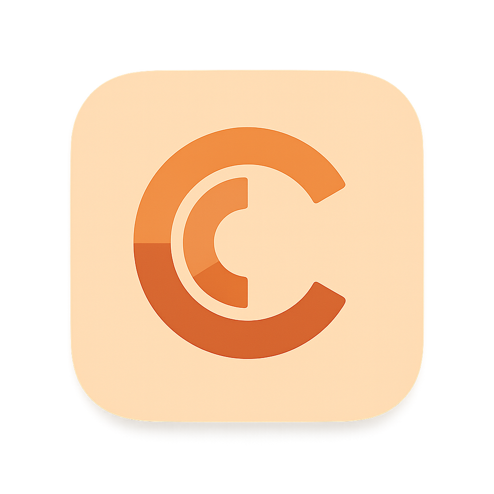
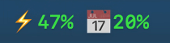
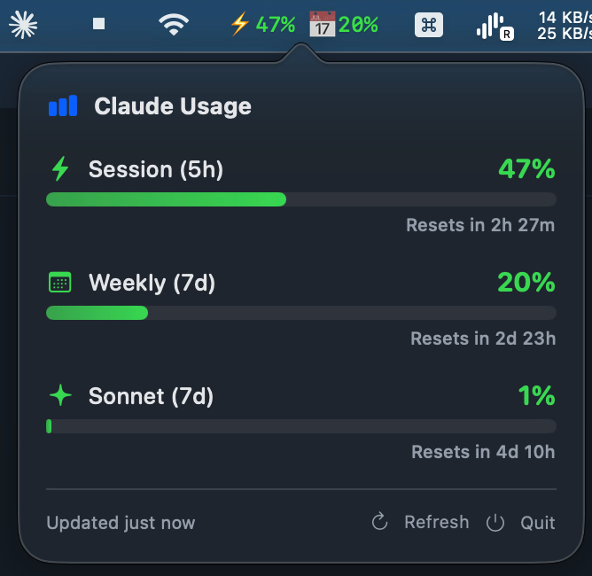

# Claude Usage Bar

**[中文版](README_CN.md)**

<p align="center">
  
</p>

<p align="center">
  <strong>A native macOS menu bar app that shows your Claude session and weekly usage in real-time.</strong>
</p>

<p align="center">
  
</p>

<p align="center">
  
</p>

## Features

- **Real-time status bar** — Always visible: `⚡0% 📅24%` shows session (5h) and weekly (7d) usage at a glance
- **Reset countdowns** — Know exactly when each usage window resets
- **Per-model tracking** — Separate Sonnet and Opus weekly usage
- **Color-coded** — Green (<50%) → Orange (50-80%) → Red (>80%)
- **Auto-refresh** — Every 5 minutes; 30s when recovering from errors
- **Launch at Login** — One-click toggle in the popover
- **Zero dependencies** — Pure Swift + SwiftUI + AppKit, no third-party libraries
- **Privacy-first** — Reads local OAuth credentials, calls Anthropic API directly, no third-party servers
- **Runs silently** — Menu bar only, no Dock icon

## How It Works

Reads OAuth credentials from Claude Code CLI (macOS Keychain) and calls the official Anthropic usage API.

```
Claude Code OAuth token (Keychain) → api.anthropic.com/api/oauth/usage → Menu bar
```

No browser, no cookies, no Chrome DevTools Protocol.

## Requirements

- **macOS 15.0+** (Apple Silicon)
- **Claude Code CLI** installed and logged in
- **Claude Max** subscription (Pro/Team should also work)

## Install

### 1. Install Claude Code CLI (if not already)

```bash
npm install -g @anthropic-ai/claude-code
claude  # Log in via browser, then Ctrl+C
```

### 2. Build & Install

```bash
git clone https://github.com/jsjixu/ClaudeUsageBar.git
cd ClaudeUsageBar
./build.sh
cp -r "Claude Usage Bar.app" /Applications/
open "/Applications/Claude Usage Bar.app"
```

Requires only Xcode Command Line Tools (no full Xcode):

```bash
xcode-select --install  # if not already installed
```

### 3. Enable Launch at Login

Click the menu bar icon → toggle **Launch at Login**.

## Status Icons

| Menu Bar | Meaning |
|----------|---------|
| `⚡12% 📅24%` | Working normally |
| `⏳ ...` | Loading |
| `🔒 Auth` | Token expired — run `claude` to refresh |
| `🔑 No Key` | No credentials — install Claude Code CLI and log in |
| `⚠️ Error` | API error (rate limit, network, etc.) |

## Architecture

```
Sources/
├── main.swift           # App entry point
├── AppDelegate.swift    # Status item + popover + adaptive refresh
├── OAuthManager.swift   # Keychain + file credential reader
├── UsageAPI.swift       # Anthropic OAuth usage API client
├── UsageModel.swift     # Codable data models
├── PopoverView.swift    # SwiftUI popover with progress bars
└── LaunchAtLogin.swift  # LaunchAgent-based auto-start toggle
```

## Configuration

The app reads Claude Code credentials automatically. No configuration needed.

If you need to use a different organization, update the org ID logic in `Sources/UsageAPI.swift`.

## License

MIT

## Acknowledgments

Built with 🦞 by [OpenClaw](https://github.com/openclaw/openclaw) — an AI agent that codes.
