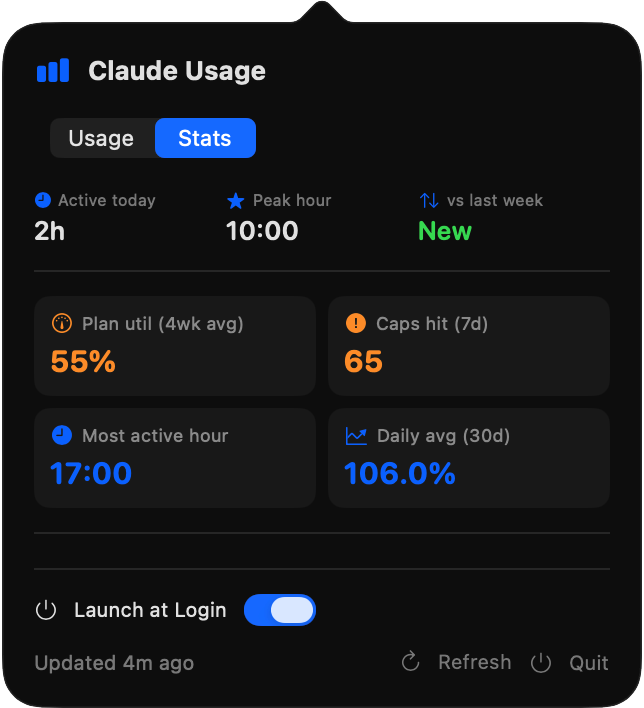
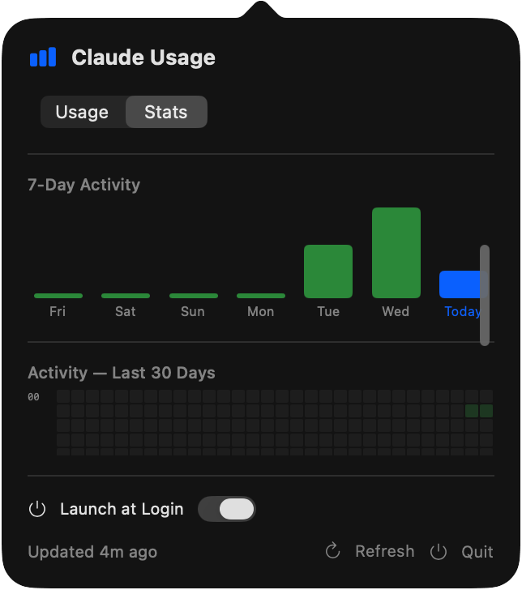

# Claude Usage Bar

<p align="center">
  
</p>

<p align="center">
  <strong>原生 macOS 菜单栏应用，实时显示 Claude 的 Session 和 Weekly 用量。</strong>
</p>

<p align="center">
  
</p>

<p align="center">
  
  
</p>

<p align="center">
  
</p>

## 功能

- **状态栏实时显示** — 常驻菜单栏：`⚡35% 📅4%`，一眼看到 Session（5h）和 Weekly（7d）用量
- **一键登录** — 点击登录按钮直接执行 `claude auth login` 弹浏览器登录，无需手动开终端
- **登录后自动刷新** — 后台每 2 秒轮询检测新凭证，登录成功自动加载用量，无需手动刷新
- **Delegated CLI Refresh** — Token 过期时，自动通过 `claude -p ping` 触发 CLI 刷新，避免 OAuth rate limit
- **智能 Token 读取** — 多源凭证优先级：CLI Proxy API → 内存缓存 → Keychain → credentials.json → Delegated CLI → OAuth refresh
- **FailureGate 双层防护** — terminal block（invalid_grant 彻底停止重试）+ transient backoff（429/网络错误指数退避），Keychain+File 双源 fingerprint 自动解锁
- **重置倒计时** — 每个窗口还有多久回血，一目了然
- **模型独立追踪** — Sonnet、Opus 周用量单独显示
- **颜色分级** — 绿色（<50%）→ 橙色（50–80%）→ 红色（>80%）
- **Stats 面板** — 历史用量统计（Usage tab + Stats tab）
- **开机自启** — 弹窗内一键开关
- **零依赖** — 纯 Swift + SwiftUI + AppKit，无第三方库
- **隐私优先** — 读取本地 OAuth 凭证，直接调 Anthropic API，不经过任何第三方
- **静默运行** — 仅菜单栏图标，不在 Dock 显示

## 工作原理

读取 Claude Code CLI 的 OAuth 凭证（macOS 钥匙串或 `~/.claude/.credentials.json`），调用 Anthropic 官方用量 API。

```
Claude Code CLI credentials (Keychain / ~/.claude/.credentials.json)
  → OAuthManager（多源凭证读取 + 自动刷新）
  → api.anthropic.com/api/oauth/usage
  → 菜单栏 + 弹窗
```

不需要浏览器，不需要 Cookie，不需要 Chrome DevTools Protocol。

## 系统要求

- **macOS 15.0+**（Apple Silicon）
- **Claude Code CLI** 已安装并登录
- **Claude Max** 订阅（Pro/Team 应该也能用）

## 安装

### 1. 安装 Claude Code CLI（如果还没装）

```bash
npm install -g @anthropic-ai/claude-code
claude  # 浏览器登录后 Ctrl+C 退出
```

### 2. 编译安装

```bash
git clone https://github.com/jsjixu/ClaudeUsageBar.git
cd ClaudeUsageBar
./build.sh
cp -r "Claude Usage Bar.app" /Applications/
open "/Applications/Claude Usage Bar.app"
```

只需要 Xcode Command Line Tools（不需要完整 Xcode）：

```bash
xcode-select --install  # 如果尚未安装
```

### 3. 开启开机自启

点击菜单栏图标 → 打开 **Launch at Login** 开关。

## 认证与 Token 管理

ClaudeUsageBar 采用多源凭证解析链，自动维持 session 有效，无需手动干预。

### 凭证优先级

| 优先级 | 来源 | 说明 |
|--------|------|------|
| 1 | **CLI Proxy API** | 最快 — 直接从 Claude CLI 守护进程读取 token |
| 2 | **内存缓存** | 进程内缓存上次成功读取的 token |
| 3 | **Keychain** | macOS 钥匙串（由 Claude Code CLI 存入） |
| 4 | **credentials.json** | `~/.claude/.credentials.json` 文件兜底 |
| 5 | **Delegated CLI Refresh** | 执行 `claude -p ping` 触发 CLI 刷新 token |
| 6 | **OAuth refresh** | 最后兜底：直接走 OAuth refresh 流程 |

### Delegated CLI Refresh（委托 CLI 刷新）

当 token 过期且直接 OAuth refresh 会触发 rate limit 时，ClaudeUsageBar 自动在后台执行 `claude -p ping`。这将 token 刷新委托给 Claude CLI 进程，由 CLI 自己处理 OAuth 流程和限速逻辑。刷新完成后，应用从 Keychain 或 credentials.json 自动取到新 token。

### FailureGate 双层防护

| 层级 | 触发条件 | 行为 |
|------|---------|------|
| **Terminal block** | `invalid_grant` 错误 | 彻底停止重试；等待 Keychain 或文件 fingerprint 变化（即重新登录）后自动解锁 |
| **Transient backoff** | 429 / 网络错误 | 指数退避；错误消除后自动恢复 |

FailureGate 同时监听 Keychain 和 `~/.claude/.credentials.json` 的 fingerprint。一旦你重新登录（通过一键登录或 `claude auth login`），新凭证的 fingerprint 变化会自动解锁 gate，恢复数据拉取。

### 一键登录流程

1. 点击弹窗中的 **Login** 按钮 → 浏览器自动打开 `claude auth login`
2. 应用每 2 秒检测一次新凭证
3. 检测到登录成功后，用量数据自动加载 — 无需手动刷新

## 状态说明

| 菜单栏显示 | 含义 |
|-----------|------|
| `⚡35% 📅4%` | 正常运行 |
| `⏳ ...` | 加载中 |
| `🔑 Login` | 未登录 — 点击弹窗中的 Login 按钮 |
| `🔒 Auth` | Token 过期 — 应用将自动尝试 Delegated CLI Refresh |
| `⚠️ Error` | API 错误（限速、网络等）— 指数退避中 |

## 项目结构

```
Sources/
├── main.swift             # 应用入口
├── AppDelegate.swift      # 状态栏 + 弹窗 + 自适应刷新 + 凭证监听 + 登录轮询
├── OAuthManager.swift     # 多源凭证读取 + DelegatedCLIRefresh
├── OAuthFailureGate.swift # 双层 FailureGate（Keychain+File fingerprint 自动解锁）
├── UsageAPI.swift         # Anthropic OAuth 用量 API
├── UsageModel.swift       # Codable 数据模型
├── UsageStore.swift       # 历史用量持久化
├── PopoverView.swift      # SwiftUI 弹窗（进度条 + 登录流程 + 远程模式配置）
├── StatsView.swift        # 用量统计与热力图
└── LaunchAtLogin.swift    # 基于 LaunchAgent 的开机自启开关
```

## 配置

单机使用无需任何配置，应用自动读取 Claude Code 凭证。

## 许可证

MIT

## 致谢

由 🦞 [OpenClaw](https://github.com/openclaw/openclaw) 驱动构建。
